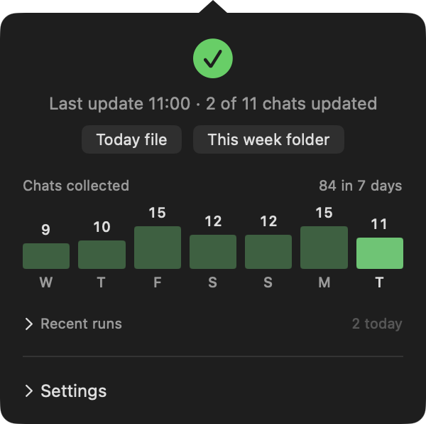

# Scrollback

<p align="center">
  
</p>

<p align="center">
  <strong>macOS menu bar app for Cursor chat recovery.</strong><br>
  See which agent sessions had real input today, collect them into a daily digest, and catch gaps before work disappears into closed tabs.
</p>

Built for the [Cursor hackathon](https://cursor.com). This repository is the **Swift menubar app and collector scripts only**; a separate marketing site is kept out of git on purpose.

---

## What it is

Scrollback watches Cursor transcript stores on disk (read-only). It does not send chat content to a cloud service. A small AppKit app in the menu bar shows collection health; shell scripts decide what counts as a chat and write the digest. The app parses fixed stdout lines (`SESSIONS|N`, progress phases, history rows) and renders them.

If the panel, the digest file, and `chats_list.sh` disagree on a number, that is a bug. The project keeps one definition of “a chat” everywhere (see `CLAUDE.md`).

## Features

- **Menu bar snapshot** of today’s typed-in Cursor sessions and collection health
- **Collect now** or **Collect chats…** for a date range, with per-chat selection
- **Daily markdown digest** on a schedule you control (hourly collection, optional write-up commands)
- **Sources panel** to include or exclude project folders without editing config by hand
- **Chats window** to audit what the collector sees for the current day
- **Script-first design**: judgements live in `*.sh` and `core/scroll.py`; the app is a thin UI
- **No Xcode project**: `swiftc` build via `Scrollback/build.sh`, no third-party dependencies
- **Privacy (on-device)**: optional scrub before any LLM summarize handoff, designed around **[Desert Ant Labs Redact](https://desertant.com/models/redact/)**, a ~12 MB Core ML model that runs **fully offline on your Mac** (no redaction traffic to the cloud)

## Privacy and redaction (offline)

Scrollback keeps raw chats on disk under your control. When you turn on **Redact locally** in the panel, text is masked **on your device** before it is passed to Cursor, Claude Code, Codex, or another summarizer.

We integrate **[Desert Ant Redact](https://desertant.com/models/redact/)** ([Desert Ant Labs](https://desertant.com)) for PII-style spans (names, emails, cards, IDs, and similar) in many languages. Redact is a small on-device model (~12 MB on Apple Silicon via Core ML); inference stays local. API keys and repo paths may still be stripped with additional local rules. Nothing in this step requires sending your chat to Desert Ant's servers.

SDK: [redact-swift](https://github.com/Desert-Ant-Labs/redact-swift) · [model card](https://huggingface.co/desert-ant-labs/redact)

## Requirements

- macOS 13 (Ventura) or later
- Xcode Command Line Tools (`swiftc`)
- Cursor installed locally if you want real transcripts to collect

## Install and build

```bash
git clone https://github.com/Alexsometimescode/scrollback.git
cd scrollback
./Scrollback/build.sh
open Scrollback/Scrollback.app
```

The build script compiles the app, stamps `VERSION` into the bundle, and copies the collector scripts into `Scrollback/Scrollback.app/Contents/Resources/scripts/` so the `.app` can live in `/Applications` on its own.

Optional: double-click `install.command` in the repo root to copy the built app to `/Applications/Scrollback.app`.

## Usage (quick demo)

1. **Launch** `Scrollback/Scrollback.app` after building. Scrollback appears as a menu bar icon (no Dock tile).
2. **First run**: open the panel and complete **Set up Scrollback** (work folders, log locations, schedule). Write-up commands are optional; collection works without them.
3. **Check status**: the headline shows how many chats count for today; open **Settings** to tune sources and times.
4. **Collect**: use **Collect now** in the panel, or **Collect chats…** to pick a date range, then **Collect selected** or **Collect all** in the chats window.
5. **Verify from the terminal** (same rules as the UI):

   ```bash
   ./scroll_status.sh | head -1
   BEAT_ALL=1 ./chats_list.sh | wc -l
   ```

   The chat count should match what the digest reports for that day.

More UI screenshots live under [`docs/`](docs/) (`settings.png`, `sources.png`, `chats.png`, `runs.png`).

## Repository layout

| Path | Role |
|------|------|
| `Scrollback/` | Swift AppKit sources and `build.sh` |
| `core/` | Python collector (parity with zsh, tests, future Windows helpers) |
| `*.sh`, `schedule.conf` | Digest, chat list, schedule, and status scripts the app invokes |
| `docs/` | Design notes and README screenshots |
| `CLAUDE.md` | Contributor rules: chat definition, stdout contracts, parity gates |

Machine-local paths go in `paths.conf` (gitignored, created at setup).

## For hackathon reviewers

| Question | Where to look |
|----------|----------------|
| What gets collected? | `docs/history-collection.md`, `docs/codex-cursor-support.md` |
| How is a chat defined? | `chats_list.sh`, `CLAUDE.md` |
| Does the app implement business logic? | Mostly no: start with `collect_now.sh`, `digest.sh`, `scroll_status.sh` |
| Python vs zsh | `core/parity.sh` and `core/selftest.py` |
| Secrets in repo? | No tokens; `paths.conf` and logs stay local |

This repo intentionally excludes marketing HTML, Cloudflare config, and prebuilt release zips. Build from source with `./Scrollback/build.sh`.

## License

MIT. See [LICENSE](LICENSE).
